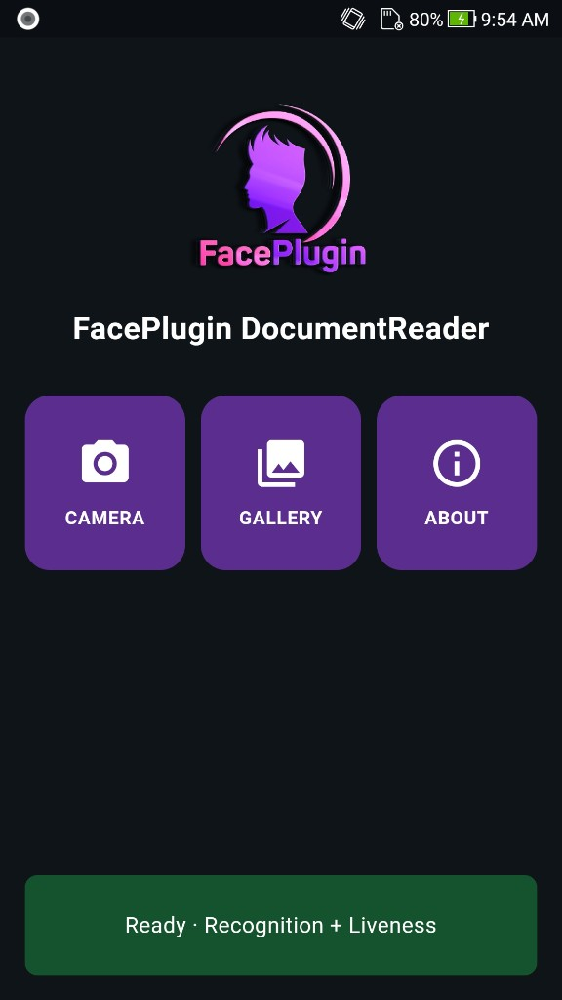
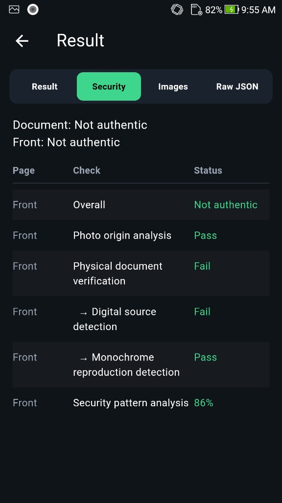
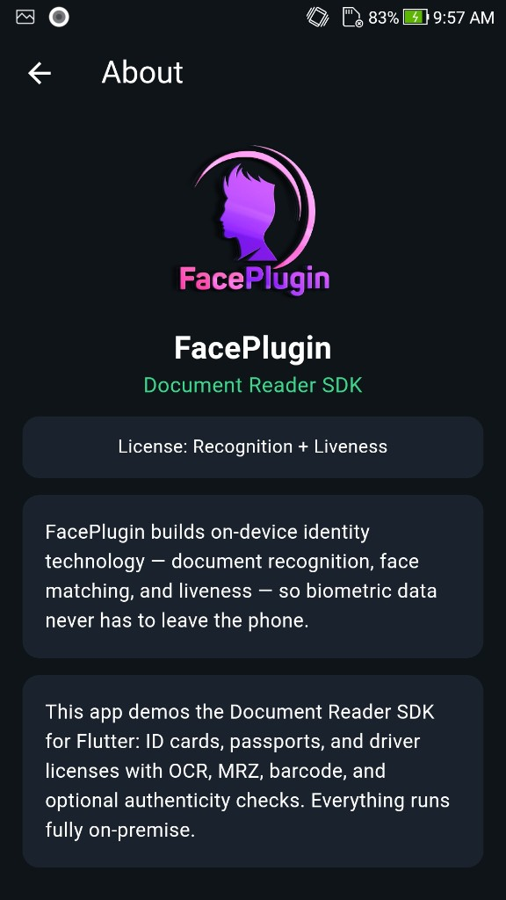

<div align="center">

</div>

#### 🌐 Company Site - [Here](https://faceplugin.com)
#### 🤗 Hugging Face - [Here](https://huggingface.co/FacePlugin-Ltd)
#### 🛟 Help Center - [Here](https://doc.faceplugin.com)
#### 🐳 Docker Hub - [Here](https://hub.docker.com/u/faceplugin)

# FacePlugin ID Document Recognition SDK — iOS (Fully On-Premise)

> Unzip `docsdk.framework.zip` into this folder → run on a **physical** iPhone (~10 min after Xcode is ready).
> Jump: [Quick Start](#quick-start) · [Get the framework](#get-the-framework-docsdkframework) · [Run the demo](#run-the-demo) · [License](#sdk-license) · [Integrate](#setup-on-your-own-app)

## Quick Start

Use this for the **sample app** (check each box in order).

- [ ] Clone [ID-Document-Recognition-iOS](https://github.com/Faceplugin-ltd/ID-Document-Recognition-iOS) on a Mac
- [ ] **Xcode 15+** (project compatibility Xcode 14; Swift 5)
- [ ] Download `docsdk.framework.zip` — [Get the framework](#get-the-framework-docsdkframework)
- [ ] Unzip and put `docsdk.framework` next to `DocumentReader.xcodeproj` (not the `.zip`)
- [ ] Open **DocumentReader.xcodeproj**
- [ ] Set **your** Signing Team; keep bundle id `com.faceplugin.documentreader.app` for the demo license (until **12 Aug 2027**)
- [ ] Run on a **physical iPhone** (simulator is not recommended)
- [ ] Grant camera when asked
- [ ] Home status bar shows **Ready** → Camera / Gallery / About

> Own app? → [Setup on your own app](#setup-on-your-own-app). Full integration: [https://doc.faceplugin.com](https://doc.faceplugin.com)

## Introduction

FacePlugin **ID Document Recognition SDK for iOS** is a fully on-device identity verification engine for ID cards, passports, and driver licenses. It delivers OCR, MRZ reading, barcode and QR extraction, live camera locate overlay, gallery capture (front required, optional back), document classification, image quality checks, extracted portraits and signatures, and authenticity / document liveness (security) checks.

This repository is the standalone **iOS demo**. The runtime is `docsdk.framework` (download from Google Drive). No other FacePlugin repository is required.

All processing stays on the iPhone. **No** biometric data is sent to FacePlugin cloud — built for KYC, eKYC, banking, and mobile onboarding that must stay private.

Native binaries are **not** on GitHub. Download the framework from the Drive link below.

### Main Functionalities

| Feature | Supported |
| ------- | --------- |
| ID Card, Passport, and Driver License recognition | ✓ |
| MRZ, Barcode, QR, and OCR data extraction | ✓ |
| Live camera locate overlay + Capture | ✓ |
| Gallery (front required, back optional) | ✓ |
| Result (fields, Security, images, JSON) | ✓ |
| Authenticity / Security (document liveness) | ✓ |
| About | ✓ |

### Product List

| Platform | Repository |
|----------|------------|
| Android | [ID-Document-Recognition-Android](https://github.com/Faceplugin-ltd/ID-Document-Recognition-Android) |
| **iOS** | **[ID-Document-Recognition-iOS](https://github.com/Faceplugin-ltd/ID-Document-Recognition-iOS)** (**this repo**) |
| Windows | [ID-Document-Recognition-Windows](https://github.com/Faceplugin-ltd/ID-Document-Recognition-Windows) |
| Linux / Docker | [ID-Document-Recognition-Docker](https://github.com/Faceplugin-ltd/ID-Document-Recognition-Docker) |
| React Native | [ID-Document-Recognition-React-Native](https://github.com/Faceplugin-ltd/ID-Document-Recognition-React-Native) |
| Flutter | [ID-Document-Recognition-Flutter](https://github.com/Faceplugin-ltd/ID-Document-Recognition-Flutter) |
| Ionic Capacitor | [ID-Document-Recognition-Ionic-Capacitor](https://github.com/Faceplugin-ltd/ID-Document-Recognition-Ionic-Capacitor) |
| Ionic Cordova | [ID-Document-Recognition-Ionic-Cordova](https://github.com/Faceplugin-ltd/ID-Document-Recognition-Ionic-Cordova) |
| Linux / Docker (Liveness) | [ID-Document-Liveness-Detection-Docker](https://github.com/Faceplugin-ltd/ID-Document-Liveness-Detection-Docker) |


---

## Before you start

| Step | What you need |
| ---- | ------------- |
| 1 | **Xcode 15+** and a **physical iPhone** (simulator is not recommended) |
| 2 | `docsdk.framework` in this folder — [Get the framework](#get-the-framework-docsdkframework) |
| 3 | Demo license is already in the repo (`licenseKey` for `com.faceplugin.documentreader.app`, valid until **12 August 2027**). Request a new key only if you change the bundle identifier — [SDK License](#sdk-license) |

Camera and Gallery unlock when the status bar shows **Ready**.

### System requirements

| Item | Minimum | Recommended |
| ---- | ------- | ----------- |
| Host | macOS with **Xcode 15+**, Swift **5.0** | Same |
| iOS | **13.0** (`IPHONEOS_DEPLOYMENT_TARGET`) | 16 or newer |
| Device | iPhone with A12 or newer | Recent iPhone |
| RAM | 4 GB | 6 GB or more |
| Camera | Rear camera | Auto-focus, 1080p |
| Device | Physical device | Same; simulator is not for camera |

---

## Get the framework (`docsdk.framework`)

`docsdk.framework` is a header stub on GitHub because the binary is too large. On Drive it is shipped as **`docsdk.framework.zip`** — unzip after you download.

### Where to download

**[DocumentReader-iOS-App runtime (Google Drive)](https://drive.google.com/drive/folders/1do6Ws_BlXGkR_K9jI_ULd1zHjqLGSP4q)** — file: `docsdk.framework.zip`

### How to place it

```bash
git clone https://github.com/Faceplugin-ltd/ID-Document-Recognition-iOS.git
cd ID-Document-Recognition-iOS
```

1. Download **`docsdk.framework.zip`** from the Drive folder.
2. **Unzip** it (double-click in Finder, or `unzip docsdk.framework.zip`). You should get a `docsdk.framework` folder — not the `.zip`.
3. Put **`docsdk.framework`** **here** (repo root, next to `DocumentReader.xcodeproj` — not in a nested folder, and not the zip file):

```text
ID-Document-Recognition-iOS/
├── DocumentReader.xcodeproj
├── DocumentReader/
└── docsdk.framework/                 ← unzipped (not .zip; engine is nested as Frameworks/dcrcore.framework)
```

If unzip creates `docsdk.framework` in Downloads, move that folder into this repo. You can delete the `.zip` afterward.

---

## Run the demo

1. Open **DocumentReader.xcodeproj** in Xcode.
2. Set your **Team** for signing. Bundle ID is `com.faceplugin.documentreader.app`.
3. Run on a device. The demo already has a valid `licenseKey` for `com.faceplugin.documentreader.app`.
4. Wait for the **status bar** at the bottom of Home: `Loading native SDK…` → **Ready**. Camera and From Gallery stay disabled until then.

Home tiles are one row under the title: **Camera** | **Gallery** | **About**.

- **Camera** — live document locate overlay; tap **Capture** when the score is ready (≥ 50%) to run on-device OCR, MRZ, barcode, and authenticity checks.
- **Gallery** — pick Front (required) and Back (optional), then Recognize for two-sided ID processing.
- **Result** — tabs **Result** / **Security** / **Images** / **Raw JSON** for fields, liveness, crops, and the full JSON response.

### Screenshots

<p align="center">

&nbsp;

&nbsp;

</p>

<p align="center">

&nbsp;

&nbsp;

</p>

<p align="center">

&nbsp;

</p>

---

## SDK License

Licenses are **offline** and bound to your bundle identifier.

The sample app already includes a valid key for `com.faceplugin.documentreader.app` (until **12 August 2027**). You only need a new key if you use a different bundle identifier.

### How to get a license

The code below shows how to use the license:

[https://github.com/Faceplugin-ltd/ID-Document-Recognition-iOS/blob/be88a3a057808ed15a4a1e74f5828a33df7d2dcd/DocumentReader/ViewController.swift#L14-L15](https://github.com/Faceplugin-ltd/ID-Document-Recognition-iOS/blob/be88a3a057808ed15a4a1e74f5828a33df7d2dcd/DocumentReader/ViewController.swift#L14-L15)

[https://github.com/Faceplugin-ltd/ID-Document-Recognition-iOS/blob/be88a3a057808ed15a4a1e74f5828a33df7d2dcd/DocumentReader/ViewController.swift#L147-L149](https://github.com/Faceplugin-ltd/ID-Document-Recognition-iOS/blob/be88a3a057808ed15a4a1e74f5828a33df7d2dcd/DocumentReader/ViewController.swift#L147-L149)

Please [contact us](#contact) to get a license for **your own app**.

### License capabilities (Recognition + Liveness)

After activation, `getLicenseStatus` reports what the key unlocks. Home shows the same summary on the status bar (for example **Ready · Recognition + Liveness**). About shows **License: …**.

| Capability | Meaning |
| ---------- | ------- |
| **Recognition** | OCR, MRZ, barcode/QR, and document type classification |
| **Liveness** (authenticity) | Document authenticity: physical document, security patterns, photo origin, barcode format |

Typical labels:

- **Recognition + Liveness** — full identity verification (Result + Security tabs)
- **Recognition** — OCR, MRZ, and barcode only; Security stays empty / not checked
- **Liveness** — authenticity / document liveness only; OCR/MRZ/barcode stays empty / not checked
- **Not licensed** — until you activate

---

## Setup on your own app

You need `docsdk.framework` and `DocSDK`. You do **not** need this demo’s `ViewController` / `CameraViewController`.

1. Copy `docsdk.framework` into your project root ([Drive](#get-the-framework-docsdkframework)).
2. In Xcode: **General → Frameworks, Libraries, and Embedded Content** → add it (**Embed & Sign**).
3. Add a bridging header (Swift): `#import <docsdk/DocSDK.h>` — Project Navigator → Build Settings → Swift Compiler - General → **Objective-C Bridging Header**.
4. Request a license for **your** bundle identifier, not the demo’s.
5. Call `initSDK` and all process methods **off the main thread**.

Full wiring, permissions, and result JSON: [https://doc.faceplugin.com](https://doc.faceplugin.com)

---

## About SDK

```swift
// Bridging header: #import <docsdk/DocSDK.h>
```

Call order (background queue): `getMachineCode` → `setActivation` → `initSDK` → `getLicenseStatus` → `recognize` / `locateDocument`. `0` = `DocSDKSuccess`. Process methods return JSON.

```swift
DispatchQueue.global(qos: .userInitiated).async {
    var ret = DocSDK.setActivation("FP1.…")
    if ret == 0 {
        ret = DocSDK.initSDK()
    }
}
```

| Method | Role |
| ------ | ---- |
| `getMachineCode` / `setActivation` / `initSDK` / `deinitSDK` | License + engine lifecycle |
| `getLicenseStatus` | Recognition / Liveness flags + label |
| `locateDocument(_:)` | Live corners + score (overlay, no OCR) |
| `recognize(_:)` | OCR / MRZ / barcode from one image |
| `recognizeFront(_:back:authenticity:)` | Front + optional back (`back` may be `nil`) |
| `documentAuthenticity(_:)` | Authenticity via `Authenticity: "normal"` |

| Code | Constant | Status |
| ---- | -------- | ------ |
| 0 | `DocSDKSuccess` | Activate / init OK |
| 1 | `DocSDKLicenseInvalid` | Invalid license |
| 2 | `DocSDKLicenseExpired` | Expired license |
| 3 | `DocSDKNotActivated` | Not activated |
| 4 | `DocSDKInitFailed` | Init failed |

---

## Contact

<div align="left">
<a target="_blank" href="mailto:info@faceplugin.com"></a>&emsp;
<a target="_blank" href="https://wa.me/+14692784822"></a>
</div>
